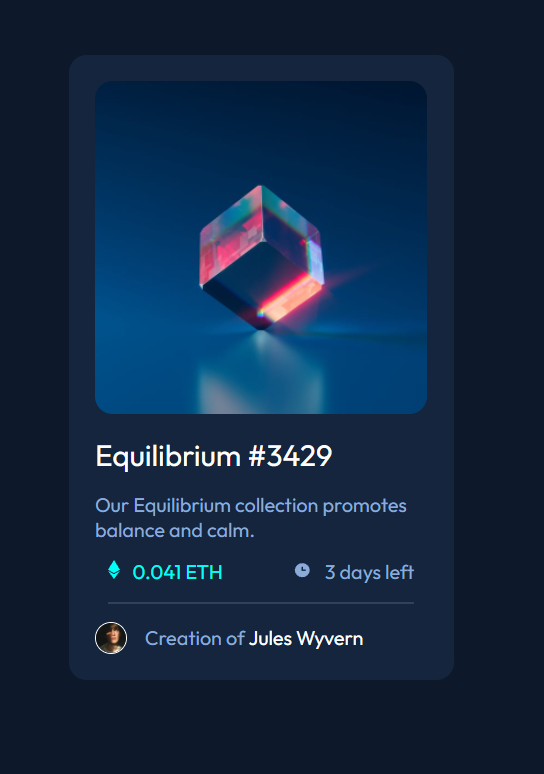

# Frontend Mentor - NFT preview card component solution

This is a solution to the [NFT preview card component challenge on Frontend Mentor](https://www.frontendmentor.io/challenges/nft-preview-card-component-SbdUL_w0U). Frontend Mentor challenges help you improve your coding skills by building realistic projects. 

## Table of contents

- [Overview](#overview)
  - [The challenge](#the-challenge)
  - [Screenshot](#screenshot)
- [My process](#my-process)
  - [Built with](#built-with)
  - [What I learned](#what-i-learned)
  - [Continued development](#continued-development)
  - [Useful resources](#useful-resources)
- [Author](#author)

## Overview

### The challenge

Users should be able to:

- View the optimal layout depending on their device's screen size
- See hover states for interactive elements

### Screenshot

## My process

  I started with the mobile version first. 

### Built with

- Semantic HTML5 markup
- Flexbox
- Mobile-first workflow

### What I learned

I learned that I need to work on my CSS more. I am learning more and more about CSS.

### Continued development

I want to focus on learning more about using flex and using the CUBE methodology to organize my code.

### Useful resources

- [Example resource 1](https://piccalil.li/blog/cube-css/) - This helped me learn about the CUBE methodology.

## Author

- Frontend Mentor - [@JasonJohnson2](https://www.frontendmentor.io/profile/JasonJohnson2)
- Twitter - [@jasontraded](https://twitter.com/jasontraded)
- Twitch - [Jason_Streams_](https://www.twitch.tv/jason_streams_)

## Acknowledgments

I found someone who had a solution for this challenge on YouTube and it gave me some ideas when I got stuck. 
(https://github.com/SankThomas) This is his GitHub profile. 
(https://youtube.com/tsbsankara) This is his YouTube.

